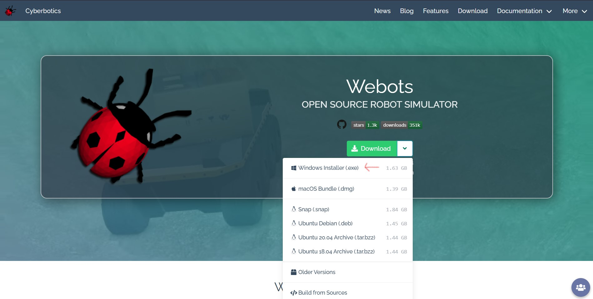
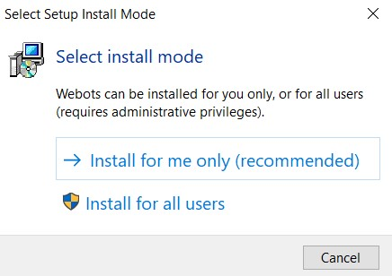
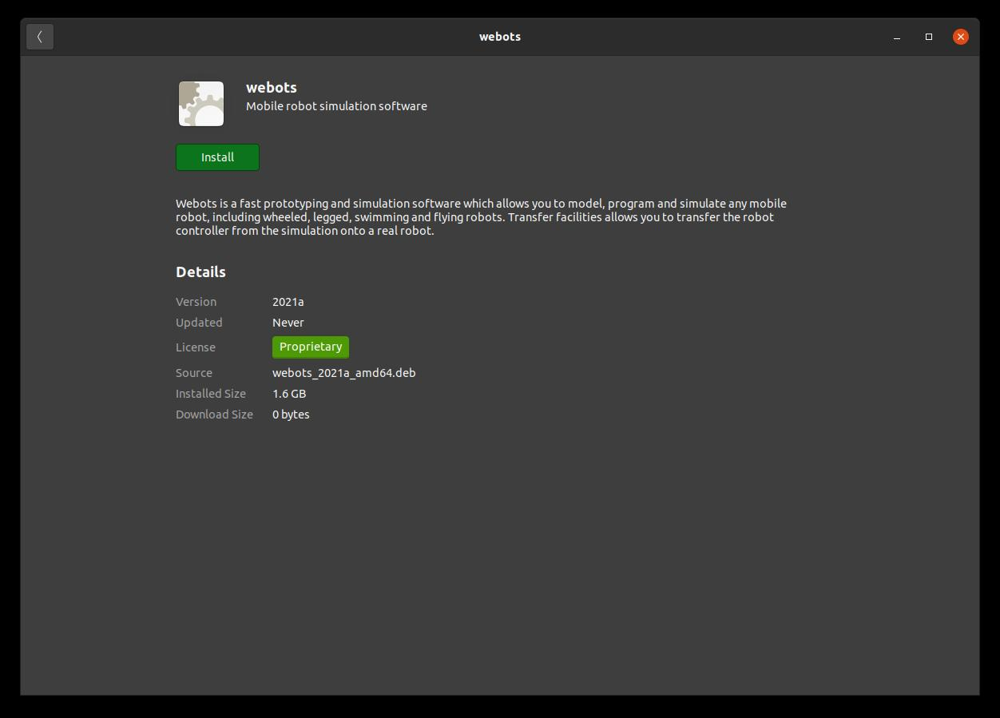
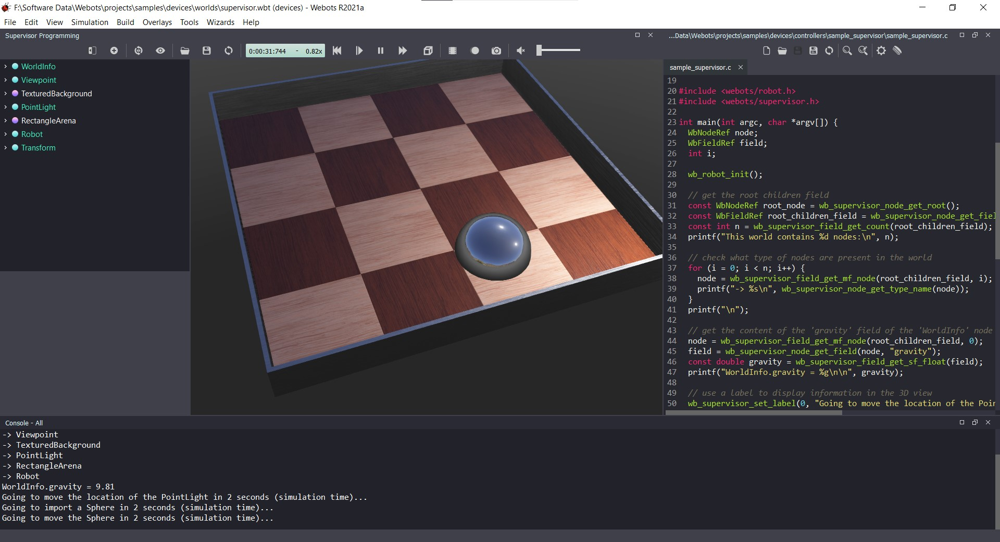
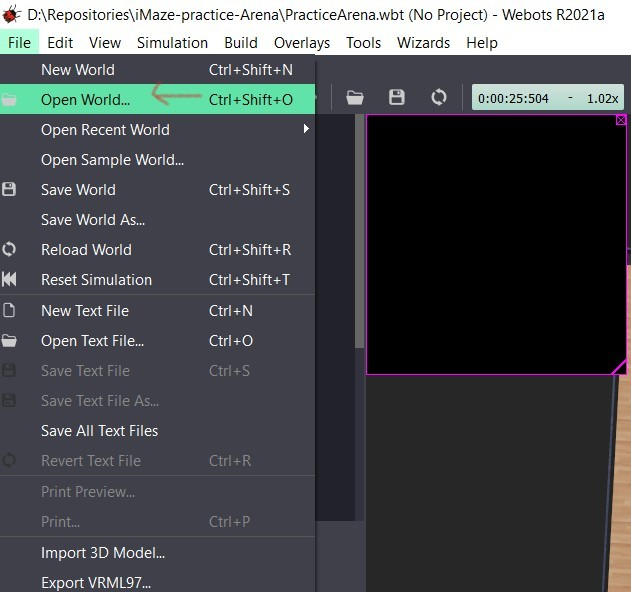
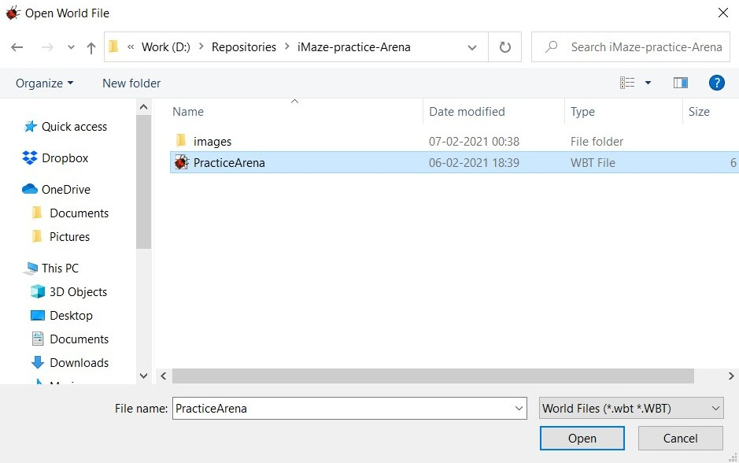

# iMaze-practice-Arena

* [Installation](#Installation)
* [Usage](#Usage)

## Installation

As this competition is going to be conducted in webots simulator, you may follow these instructions to install webots locally

### Windows

* Download webots setup file(shown below) from the official website - https://cyberbotics.com/

  

* Open the file and choose *Install for me only* option

  

* And then follow the prompts (*Next*, *Next*, ..., *Install*).

### Linux

* Download .deb file (shown below) from the official website - https://cyberbotics.com/

  

* Go to the directory where you have downloaded the file and just double click the file. You can see something like below, just click *install*

  

## Usage

Now that you have downloaded webots in your computer, you may follow these instruction to clone this repository, load the arena.

### Clone this repository

* Firstly, install git in your computer. You may follow this tutorial - https://phoenixnap.com/kb/how-to-install-git-windows

* Then open command prompt (*in windows*) or terminal (*in linux*) and clone this repository

  ```shell
  git clone https://github.com/Robotics-Club-IIT-BHU/iMaze-practice-Arena.git
  ```

### Load the arena

* Open the webots simulator and you are expected to see a window as shown below

  

* Click on *File* then *Open World* as shown below

  

* Go to the folder where you have cloned this repository and select `PraticeArena.wbt` file as shown below

  