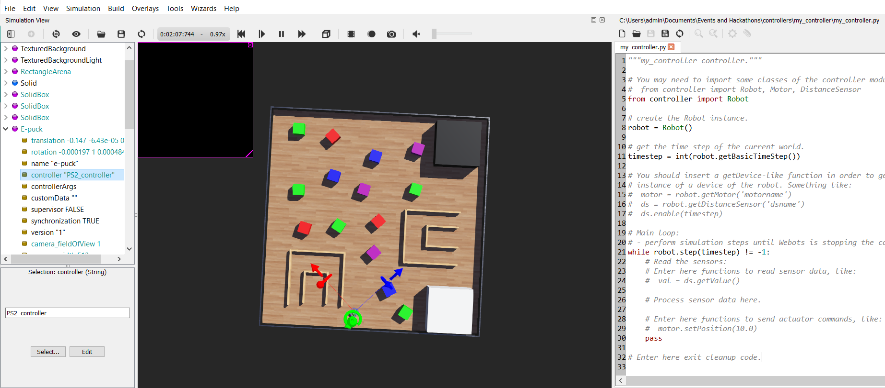

# iMaze-practice-Arena

This is a repository which contains practice arena for the competition **iMaze** conducted by [Robotics Club, IIT BHU](https://github.com/Robotics-Club-IIT-BHU).

* [Installation](#Installation)
* [Usage](#Usage)

## Installation

As this competition is going to be conducted in webots simulator, you may follow these instructions to install webots and python locally

### Windows

#### Webots Installation

* Download webots setup file(shown below) from the official website - https://cyberbotics.com/

  

* Open the file and choose *Install for me only* option

  

* And then follow the prompts (*Next*, *Next*, ..., *Install*).

#### Python installation : (If Python is not already installed)

* Open the https://www.python.org/downloads/  in your web browser. Navigate to the Downloads tab for Windows. Choose any Python 3.7.x

* Click on the link to download **Windows x86 executable installer** if you are using a 32-bit installer. In case your Windows installation is a 64-bit system, then download **Windows x86-64 executable installer**(shown below).


* Once the installer is downloaded, run the Python installer.

* Make sure you select **"Add Python3.7 to PATH"** option before starting the installation.

* You can now start the installation of Python by clicking on **Install Now**.

### Linux

#### Webots Installation

* Download .deb file (shown below) from the official website - https://cyberbotics.com/

  

* Go to the directory where you have downloaded the file and just double click the file. You can see something like below, just click *install*

  
  

#### Python installation : (Only if python is not installed previously)

* Update the packages list and install the prerequisites:

  ```
  $ sudo apt update
  $ sudo apt install software-properties-common
  ```
  
* Add the deadsnakes PPA to your system’s sources list:

  ```
  $ sudo add-apt-repository ppa:deadsnakes/ppa
  ```

* you can install Python 3.7 by executing:

  ```
  $ sudo apt install python3.7
  ```

* Verify that the installation was successful by typing:

  ```
  python3 --version
  ```

## Usage

Now that you have downloaded webots in your computer, you may follow these instruction to clone this repository, load the arena, create a custom controller and connect it to robot.

If you don't have git pre installed in your system,then simply download the zip file by clicking the green 'code' button above and then extract it.

### Clone this repository

* Firstly, install git in your computer. You may follow these tutorials - [Windows](https://phoenixnap.com/kb/how-to-install-git-windows) | [Linux](https://www.atlassian.com/git/tutorials/install-git#linux)

* Then open command prompt (*in windows*) or terminal (*in linux*) and clone this repository

  ```shell
  git clone https://github.com/Robotics-Club-IIT-BHU/iMaze-practice-Arena.git
  ```

### Load the arena

* Open the webots simulator and you are expected to see a window as shown below

  

* Click on *File* then *Open World* as shown below

  

* Go to the folder where you have cloned this repository and select `PraticeArena.wbt` file (inside the folder named worlds) as shown below

  
  
### Making a Custom Controller

* Once you have opened the World, click on Wizards -> New Robot Controller

  

* Click on Next

  

* Select **Python** and then click Next

  

* Provide a Name for your Controller

  

* Click on Finish 

  

### Connecting your Controller to the Robot

* On the left side of the screen navigate to E-puck -> controller "PS2_controller" and then click on Select

  

* From the available options choose your controller and then click OK

  
  
### Helper Functions in Webots
*Loading the device* - You can load the necessary devices, by using these functions.
~~~
left_motor = robot.getDevice('left wheel motor')
right_motor = robot.getDevice('right wheel motor')
ir_sensor = robot.getDevice('ps0')
camera = robot.getDevice('camera')
~~~
*Initializing the motors* - Each motor's position is set to infinity, as if it set to a real number then the motors will stop after they have rotated by the number of radians specified.
Initially, the velocity is set to 0, to ensure the robot is at a stop and not moving.
~~~
left_motor.setPosition(float('inf'))
right_motor.setPosition(float('inf'))
left_motor.setVelocity(0.0)
right_motor.setVelocity(0.0)
~~~
*Actuation of the motors* - You'll be using velocity control method, to control the motors of the robot.
~~~
left_motor.setVelocity(speed)
right_motor.setVelocity(speed)
~~~
*Initializing the sensors and reading values*
~~~
ir_sensor.enable(timestep)
ir_sensor.getValue()
~~~
*Initializing the camera and reading values*
~~~
camera.enable(timestep)
camera.getImageArray()
~~~
